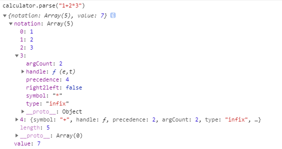
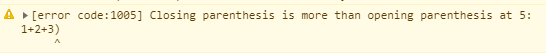

# calculator
一个数学表达式的解析工具

+ 可以运行在微信小程序
+ 支持IE9+
+ 支持AMD/CommonJS规范
+ 支持自定义数学运算符

你可以使用该解析工具将一个数学表达式解析为一个逆波兰表达式或者计算表达式的值。例如，如果解析`1+2*3`这个表达式，得到的逆波兰表达式为`+ * 3 2 1`，计算结果为`7`。

## 安装

### 下载脚本

点击这里并引用对应的脚本文件:

```html
<script src="/dist/calculator.min.js"></script>
<!-- or -->
<script src="/dist/calculator.js"></script>
```

### 包管理器

#### NPM

```shell
$ npm install @iboxer/calculator --save
```

#### AMD

```javascript
require(['./dist/calculator.js'], function(Calculator) {
  var calculator = new Calculator()
  calculator.parse("1+2+3")
})
```


## 用法

**实例化**

```javascript
var calculator = new Calculator();

```

**解析**

```javascript
var result = calculator.parse("1+2*3");
console.log(result);
```
得到以下结果:



+ **value**: 表达式计算后的值
+ **notation:** 解析表达式得到的逆波兰表达式

解析后可以通过`result.value` 获得计算的结果，通过`result.notation`获得逆波兰表达式。

该解析工具支持常见的数学运算（如四则运算）的解析以及函数的解析。当前主要支持以下数学运算符和函数：

|Operator（运算符）|Type（类型）  |Precedence（优先级） |说明|
|:-------|:----:|------|:----------|
|`+`      |prefix |3|正号|
|`-`       |prefix|3|      |负号|
|`+`       |infix|2     |加法|
|`-`       |infix|2      |减法|
|`*`       |infix|4      |乘法|
|`/`      |infix|4      |除法|
|`|`       |infix|4      |求余|
|`%`       |postfix|6      |百分率|
|`(`,`)`      |prefix,postfix |0     |括号|
|`!`       |postfix|6      |阶乘|
|`^`       |infix|4      |指数运算|
|`√`       |infix|4      |开N次方|
|`log`     |func |0     |对数运算|
|`abs`     |func |0     |求绝对值|
|`sin`,`tan`,`cos`|func|0    |三角函数|
|`,`          |infix|1     |函数参数分隔符|


**API**

你可以利用`definedOperators(Object|Array)`这个API自定义一组数学运算符和函数。例如，你要定义一个求商的运算符`//`和一个求圆的面积的函数`ca`，那么你可以这么做：

```javascript
calculator.definedOperators({
  token: "//",
  type: "infix",
  func: function(a, b) {
    return Math.floor(a / b);
  },
  weight: 4
});
calculator.definedOperators({
  token: "ca",
  type: "func",
  func: function(r) {
    return Math.PI * r * r;
  }
});

console.log("ca(5) = ", calculator.parse('ca(5)').value); // ca(5) =  78.53981633974483
console.log("10 // 3 + 2 = ", calculator.parse('10 // 3 + 2').value); // 10 // 3 + 2 = 5
```

|参数 |  类型  | 是否必须 | 说明 |
|:------:|---|---- |:----------|
|`token` | String  | 是   |运算符名称，不能是`(`, `)`or`,`这三个字符|
|`func`  | Function  |  是  |处理的函数 |
|`type`  | String  | 否   |t运算符类型,只能是`prefix`,'infix',`postfix` and `func`（分别是前缀、中缀、后缀以及函数类型）,默认值是 `func` |
|`weight` | Number  | 否  |运算符计算权重，默认是 `0`|
|`rtol`   |Boolean   | 否   |是否为一个右结合运算符（如阶乘）,默认值 `undefined`|

> **同一个操作符只能可以同时是`infix` and `prefix`类型，例如加法和正号可以同时存在，但是`infix` and `postfix` 是互斥的**
> **`definedOperators`可以传入对象，也可以传入对象的数组来同时定义一组运算符**


## 错误处理

当解析一个不合法的表达式时，将会得到一个错误，但为了可以自定义错误的处理方式，因此不会直接跑出异常，而是返回了一个包含错误码和错误信息的对象：

```javascript
{
  code: 1004,
  message: "Opening parenthesis is more than closing parenthesis"
}
```
同时在控制台里会打印出一个包含具体错误位置的警告信息，如下:



目前支持的错误类型有以下几个：

| code | description|
|:----:|--------|
|1001|包含未定义的操作符|
|1002|语法错误|
|1003|函数后面缺少左括号|
|1004|左括号数量比右括号多|
|1005|右括号数量比左括号多|

## Demos

[Demos](./test/index.html)

